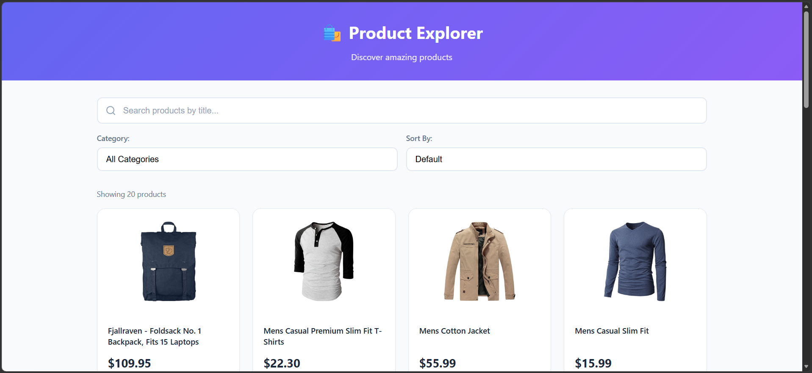

Product Explorer

A modern and responsive product browsing application built with React, TypeScript, and Vite. Users can explore products, search items, filter by category, sort by price, and view detailed product information in a clean UI.

🚀 Tech Stack
React
TypeScript
Vite
CSS

✨ Features
📦 Product Listing
🔍 Search Products
🗂️ Category Filter
💰 Price Sorting
🪟 Product Details Modal/View
⏳ Loading State
❌ Error Handling
📱 Responsive UI Design
📸 Screenshots

⚙️ Installation & Setup

Clone the repository:

git clone <https://github.com/anmolbajpai/Product-Explorer>

Move into the project folder:

cd product-explorer

Install dependencies:

npm install

Run the development server:

npm run dev
🌐 API Used
const API_URL = "https://fakestoreapi.com/products";

API Provider:

Fake Store API

📂 Project Structure
src/
│
├── components/
├── hooks/
├── services/
├── types/
├── App.tsx
├── App.css
└── main.tsx

🧠 Functionalities

Search

Users can search products by title.

Filter

Products can be filtered category-wise.

Sorting

Products can be sorted by price:

Low to High
High to Low
Product Details

Clicking a product opens a detailed product modal/view.

📱 Responsive Design

The application is fully responsive and works across:

Desktop
Tablet
Mobile devices
🛠️ Built With
React
TypeScript
Vite
📄 License

This project is open source and available under the MIT License.